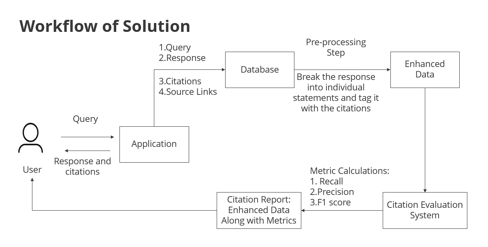

# 📊 Citation Quality Evaluator

This project evaluates the quality and necessity of citations in AI-generated text. It uses the OpenAI GPT-4 API to assess how well citations support factual statements in an assistant's response.

## 🚀 Features

- Calculates **Recall**, **Precision**, and **F1 Score** for cited statements.
- Provides explanations (reasoning) for these metrics.
- Determines whether uncited statements **require a citation**.
- Tracks OpenAI **token usage** for cost estimation.
- Outputs results to both **JSON** and **CSV** formats.

---

## 🧭 Architecture Overview




## 📂 Input Format

The input CSV should contain the following columns:

| Column Name       | Description                                                  |
|------------------|--------------------------------------------------------------|
| `question`        | The user's original question                                 |
| `response`        | The AI assistant's full response                             |
| `context_id`      | An identifier for the context/session                        |
| `statement_index` | Index of the current statement in the response               |
| `statement`       | A single statement from the response                         |
| `citations`       | Citation references (can be empty `[]`)                      |
| `snippets`        | Citation text snippets used to support the statement         |
| `documents`       | Source documents related to the citations                    |

---

## 📤 Output Files

- `output_data_with_usage.json`: Contains detailed evaluation results in JSON format.
- `output_data_with_usage_and_metrics.csv`: Contains tabular results, including:
  - Recall, Precision, F1 Score
  - Reasoning for recall and precision
  - Citation need status and analysis
  - Token usage data

---

## 🧠 Evaluation Logic

The script evaluates the quality of citations using three main metrics: **Recall**, **Precision**, and **F1 Score**. These are determined by querying the GPT-4 model with custom prompts that assess the alignment between a statement and its cited evidence.

### 🔎 Recall

**Definition**: Measures how well the **statement is supported** by the provided citation snippets.

- **Prompt**: The model is asked whether the statement is fully, partially, or not at all supported by the snippets.
- **Scale**: Returns a numeric value between `0.0` (not supported) and `1.0` (fully supported), along with reasoning.

> High recall = the citation snippets contain all or most of the information needed to support the statement.

---

### 🎯 Precision

**Definition**: Measures how relevant the **citation snippets are to the statement**.

- **Prompt**: The model is asked if the snippets are actually about the statement (or if they include unrelated info).
- **Scale**: Returns a numeric value between `0.0` (not relevant) and `1.0` (completely relevant), with an explanation.

> High precision = the snippets focus directly on the claim made in the statement, without introducing unrelated details.

---

### 🔁 F1 Score

**Definition**: The harmonic mean of precision and recall, used to balance both aspects.

\[
F1 = \frac{2 \times (Precision \times Recall)}{Precision + Recall}
\]

- If either precision or recall is zero, F1 is zero.
- A high F1 score indicates both that the citation supports the claim and is highly relevant.

---

### 🧠 Example Flow (for statements with citations)

1. **Recall Check**: Ask the model — *"Does the statement align with the content of the citations?"*
2. **Precision Check**: Ask the model — *"Do the citations pertain specifically to this statement?"*
3. **F1 Calculation**: Compute based on recall and precision values.

The results include:
- Numerical scores (Recall, Precision, F1)
- Model-generated justifications for each score
- Token usage metadata for performance tracking

---

### 🕵️ Statements Without Citations

For uncited statements, the script checks:

- **"Does this statement need a citation?"**
- It flags only factual or document-dependent statements — not summaries, transitions, or general language.
- The model returns:
  - `Need Citation: Yes/No`
  - A short explanation of why

---


## ⚙️ Requirements

- Python 3.8+
- OpenAI Python SDK

Install dependencies:

```bash
pip install openai
